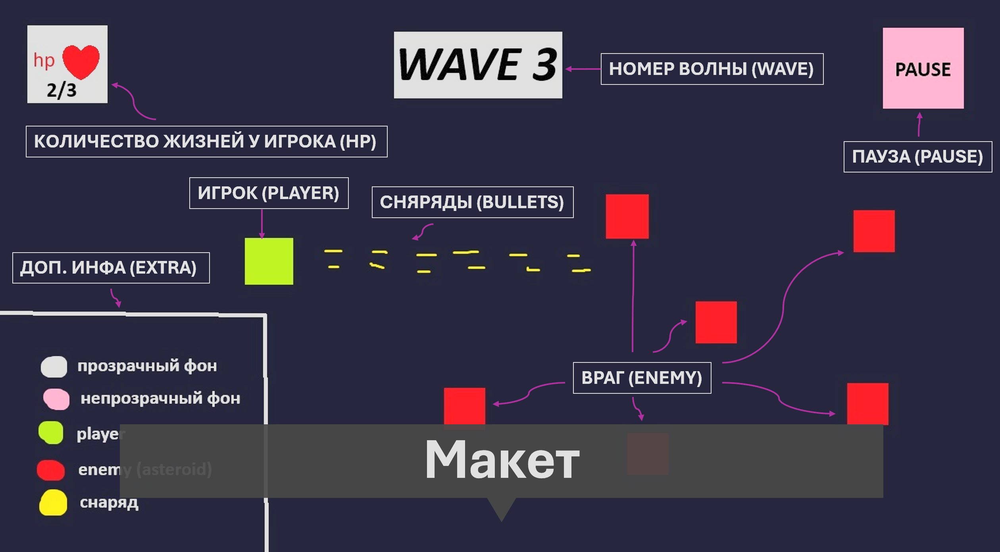
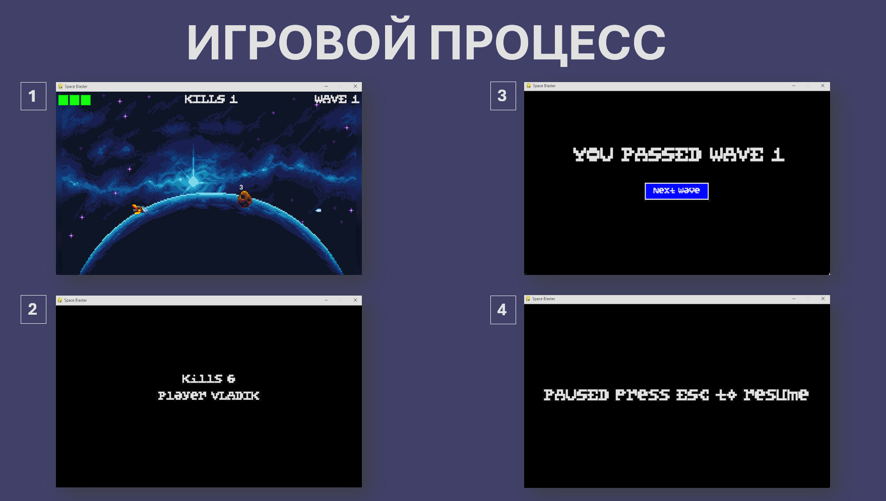
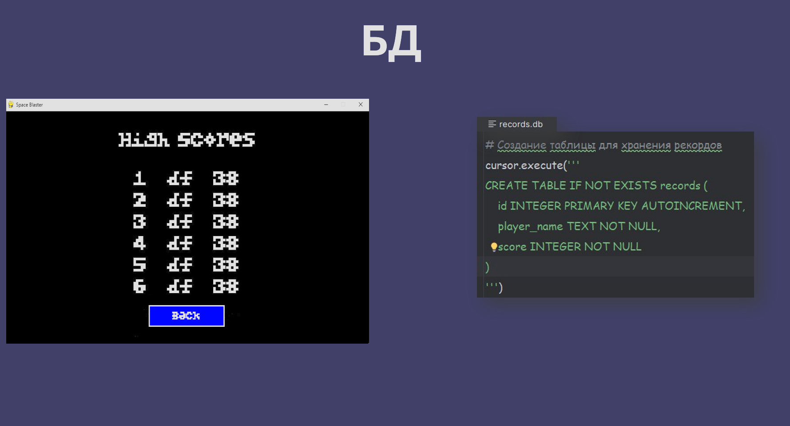

## Space Blaster
> Динамичный аркадный шутер на Python с использованием Pygame


## Об игре
**Space Blaster** — это двухмерная аркадная игра, разработанная с использованием библиотеки Pygame. 
Игрок управляет космическим кораблем, сражаясь с волнами врагов и боссами в космическом пространстве. 
Цель игры — выжить как можно дольше, уничтожая врагов и проходя волны, каждая из которых становится 
сложнее предыдущей.

### Геймплей

- Управление кораблем с помощью клавиш стрелок (WASD или стрелки)
- Стрельба по врагам клавишей пробела
- Три волны с возрастающей сложностью:
    - **Волна 1**: уничтожьте 6 врагов
    - **Волна 2**: уничтожьте 12 врагов
    - **Волна 3**: битва с боссом (10 HP)
- Система жизней: при потере всех жизней игра заканчивается
- Пауза по клавише ESC

### Скриншоты





### Функционал проекта:
#### Игровая механика:
* Управление кораблем осуществляется с помощью клавиатуры (WASD или стрелки).
* Стрельба выполняется нажатием пробела.
* Возможность собирать бонусы, такие как ускорители, дополнительные жизни и усиленное оружие.

#### Уровни сложности:
* Уровень 1: простые астероиды, медленное движение.
* Уровень 2: появление крупных астероидов, которые дробятся на мелкие части при попадании.
* Уровень 3: финальная битва с огромным астероидом с высоким запасом здоровья.

#### Бонусы:
* Ускорение: временное увеличение скорости выстрелов корабля.
* Мощность оружия: временное усиление урона от выстрелов.
* Heal: восполнение части потерянных жизней.

#### Враги:
* Астероиды: разного размера и скорости.
* Босс: огромный астероид с высоким запасом здоровья.

#### Интерфейсы:
* Главное меню: кнопки «Начать игру», «Выход».
* Экран паузы: кнопка «Продолжить», «Вернуться в главное меню».
* Экран завершения уровня: показывает количество уничтоженных объектов, набранные очки и кнопку «Начать заново»/«Вернуться в главное меню».

#### Графические элементы:
* Спрайты для космического корабля игрока, астероидов, и бонусов.
* Фоновые изображения космоса для разных уровней.
* Эффекты взрывов и лазерных выстрелов.

#### Система сохранения прогресса:
* Возможность сохранять текущий прогресс после каждого уровня.
* Загрузка сохраненного прогресса из главного меню.

#### Результаты игроков сохраняются в базе данных SQLite:
* id — уникальный идентификатор
* player_name — имя игрока
* score — количество убитых врагов

Просмотр таблицы рекордов доступен из главного меню.

#### Дополнительные функции:
* Система достижений: за выполнение определенных задач (например, уничтожение большого числа астероидов без потерь).
* Таблица рекордов для отслеживания лучших результатов.

### Управление
|Клавиша| Действие         |
|-------|------------------|
|↑ / W| 	Движение вверх  |
|↓ / S| 	Движение вниз |  
|← / A| 	Движение влево | 
|→ / D| 	Движение вправо |
| Пробел|	Стрельба |
|ESC |	Пауза |

### Планы по развитию
* Добавление звуковых эффектов и музыки
* Новые типы врагов и боссов
* Дополнительные уровни
* Система бонусов и улучшений
* Режим "Бесконечная волна"
* Сетевая игра

### Технологии
- **Pygame** — создание 2D-игр
- **SQLite** — встроенная база данных
- **Python** — язык программирования
- **Ресурсы**:
    - [Шрифты](https://ttfonts.net/ru/download/46224.htm)
    - [Спрайты](https://www.gamedevmarket.net/asset/space-shooter-1-5280)

### Требования
- Python 3.8 или выше
- Pygame 2.0 или выше

### Установка
1. Клонируйте репозиторий:
```bash
#!/bin/bash

git clone https://github.com/aizXc901/Space-Blaster.git
cd Space-Blaster
```
2. Установите зависимости:
```bash
#!/bin/bash

pip install -r requirements.txt
```
3. Запуск игры:
```bash
#!/bin/bash

python main.py
```

### Авторы 
* Байкова Мария
* Плетнёв Михаил

### Лицензия
Этот проект распространяется под лицензией MIT. Подробности в файле LICENSE.